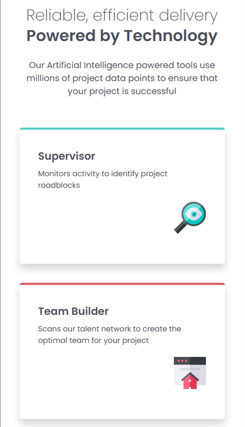
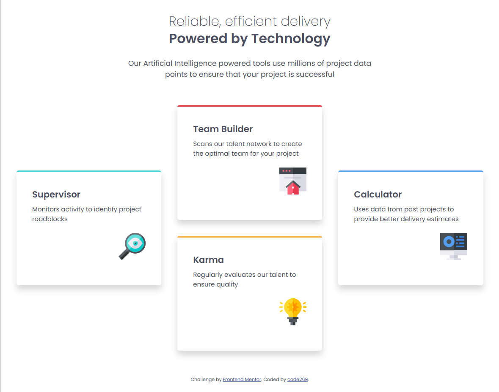

# Frontend Mentor - Four card feature section solution

This is a solution to the [Four card feature section challenge on Frontend Mentor](https://www.frontendmentor.io/challenges/four-card-feature-section-weK1eFYK).

## Table of contents

- [Overview](#overview)
  - [The challenge](#the-challenge)
  - [Screenshot](#screenshot)
  - [Links](#links)
- [Author](#author)

## Overview

### The challenge

Users should be able to:

- View the optimal layout for the site depending on their device's screen size

### Screenshot

Mobile:

Desktop:

### Links

- Solution URL: [GitHub](https://github.com/code269/fem-four-card)
- Live Site URL: [Deployment](https://your-live-site-url.com)

## Author

- Website - [GitHub - code269](https://github.com/code269)
- Frontend Mentor - [FEM - @code269](https://www.frontendmentor.io/profile/code269)
